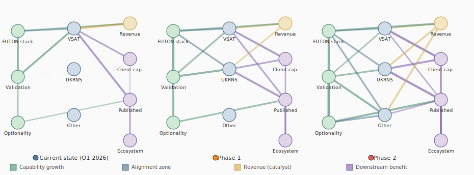

# Hyperreal Enterprises: A Capability-Growth Value Model

The standard question for a small consulting operation is: how do you maximise revenue? The Hyperreal model inverts this. The objective function is capability growth across the FUTON stack — the accumulation of validated methods, reusable patterns, and proven infrastructure that widens what is possible next. Revenue is a catalytic constraint: enough must flow to sustain the work, but the steering variable is upstream capability, not downstream income. The ideal is to spend as little time as possible earning money, which requires either a high hourly rate or — preferably — strong alignment between paid work and capability growth, so that billable hours also grow the bank.

This framing derives from the Grand Unified Placemat, which models Hyperreal's sustainability as a prism with three faces: participatory sustainability (UKRNS evaluation), fiscal sustainability (VSAT client work), and organisational sustainability (FUTON stack). Each face is extruded along a maturity axis (I0–I4) measuring how far the system has progressed from aspiration to self-sustaining operation. The value-flow model below is a quantitative projection of this structure.

## The value network

Ten nodes are arranged in four zones. The causal direction runs left to right, but the critical feedback loop runs right to left: revenue feeds back into stack development, which strengthens the methods, which improves alignment quality, which makes the next round of paid work more productive.

**Upstream (green):** the objective function. The FUTON stack accumulates invariants, patterns, and tooling. Method validation tests these in real contexts. Each validated method widens the optionality bank — the breadth of domains the capability can serve.

**Alignment zone (blue):** where upstream capability meets paid work. VSAT work, UKRNS evaluation, and other engagements each exercise different methods under real constraints. High-alignment work grows the bank while earning revenue; low-alignment work earns revenue but does not grow the bank. The alignment ratio is the key diagnostic.

**Revenue (gold):** the catalyst. Revenue sustains the cycle. It does not steer it. The revenue node feeds back to the FUTON stack — this is the loop that must close.

**Downstream (purple):** what the work produces for others. Client capability, published knowledge, ecosystem benefit. These are consequences of high-alignment work, not objectives to be maximised independently.

The three panels show a growth trajectory, not competing strategies. In the current state (Q1 2026), a single high-alignment client (Oxford Brookes) activates the VSAT node; UKRNS and other engagements are dormant (dashed edges). In Phase 1 (mid-2026), UKRNS activates — a second independent context for method validation. In Phase 2 (late 2026), the optionality bank is large enough that new engagements arrive through reputation, and the revenue constraint is met with less effort. Both phases could be brought online within about six months if the current trajectory holds.

## What the invoice evidence shows

Three invoices span September 2025 to March 2026: 35.5 billable hours, £2,662.50, all from one client. The alignment quality increases over time.

The first invoice (Oct 2025) is mostly meetings and exploratory trips. The strongest alignment signal is the Codex bug fix — a one-hour task that proved AI-assisted development works on the codebase, validating a transferable method. The PatCon30 talks generate 50+ contacts, feeding the optionality bank directly.

The second invoice (Dec 2025) introduces architecture work. The VSATLAS conceptual design document scores high on method validation because the document itself exercises flexiarg-style structured argument — the FUTON method is the deliverable.

The third invoice (Mar 2026) is dominated by high-alignment work. The VSATLAS full-stack implementation exercises FUTON methods under real production constraints. The value-chain analysis produces a reusable Bayesian pipeline that is now being applied to this very model. The method *is* the deliverable, and the deliverable *is* the method validation.

The trajectory: meetings → features → architecture → infrastructure → self-reflexive analysis. Each phase builds on the last, and each feeds more weight into the upstream edges.

## Capability growth versus revenue

The scatter plot shows that revenue and capability growth are not in structural tension — unlike the VSAT model, where services-first and software-first occupied opposing regions. Here, the current state, Phase 1, and Phase 2 move from lower-left to upper-right: more revenue *and* more capability. This is what high alignment looks like in the model. The risk would be a scenario that moves rightward (more revenue) without moving upward (capability stagnates) — that would mean the alignment ratio has dropped.

## What the model does not yet capture

The "other engagements" node is currently a placeholder. As new clients or projects come on board, each will bring its own interconnection pattern — and interconnection density is itself a value signal. A client whose work activates three upstream edges is worth more to the model than one whose work activates only the revenue edge, even at the same hourly rate. When the node decomposes into named engagements, the model will need to track this per-client alignment profile.

The UKRNS face of the placemat is now partially active. The ORP T3 evaluation produced a population model (`vsat.wiki/ukrn-demo/assumptions-v2.edn`) that applies the same Bayesian pipeline used for VSAT value chains to a different domain: institutional evaluation over 16 NPT factors. Nine institutional profiles were scored from focus-group transcripts, patterns were computed via gate/support aggregation (encoding the coordination-complexity gradient), and scenario analysis showed how five UKRN-S levers shift the population distribution across implementation modes. The method generalises: the Clay/Quarto pipeline, the EDN assumptions format, the forward-sampling architecture, and the SVG visualisation layer all transferred without structural modification. What changed was the domain semantics (NPT factors instead of financial flows, patterns instead of revenue streams, implementation modes instead of surplus/deficit).

This answers the most important open question from the initial model: does FUTON generalise beyond software development contexts? The answer is a qualified yes. The Bayesian pipeline generalises. The gate/support aggregation rule (where bottleneck factors cap pattern strength) is a structural innovation that did not appear in the VSAT model, which used weighted averages throughout. The NPT-based institutional profiles are richer than the abstract scenarios used in the VSAT analysis. And the "things to try / things to measure" table in the working paper appendix connects the model's levers to the T1 instrument — the inter-edge (X-t1-instrument) from the Grand Unified Placemat — providing a concrete Bayesian update pathway.

The `:ukrns-work :to :method-validation` edge is now the strongest in the UKRN column (weight 7), reflecting that the method transfer itself is the primary capability-growth signal from this engagement.

## The missing edge: shared story surfaces as cross-context evaluation

The value network has no direct edge between VSAT work and UKRNS work. That is correct — neither client engagement produces the other's deliverables. But the indirect connection through the method-validation and optionality-bank nodes understates something structural: the *architecture* that VSAT produces is the architecture the UKRN CoP needs, and the *evaluation evidence* the UKRN network generates is the method validation VSAT needs.

Consider the UKRN population model's findings. Visible Impact (the weakest pattern, coordination complexity: very high) fails because there is no shared surface where institutional experiences become legible to each other. The solo librarian (FG3-A) cannot see how the RSE at the massive university (FG2B-P1) adapted delivery. The ORCA coordinator (FG2A-P3) cannot see which institutions achieved multiplied mode and what they did differently. Each institution's experience is a story — what they tried, what worked, what the local conditions were — but the stories are siloed.

A VSATLAS-inspired architecture for the CoP would treat each institutional experience as a story node in a constellation, linked through the NPT factors that structure the evaluation. FG3-A's account of institutional delegitimation and FG1-P1's account of strong ownership are connected through the Legitimation–Activation pathway — not because the participants know each other, but because their experiences illuminate the same structural question from opposite ends. The constellation IS the evaluation. The stewardship layer that governs link quality and story retirement IS the Shared Maintenance pattern. Evaluation becomes a byproduct of sharing rather than a separate research activity.

This is the kind of connection Hyperreal makes possible. The same architectural pattern (interconnected structured accounts, navigable through typed links, governed by a stewardship layer) applies whether the domain is immersive storytelling (VSAT), institutional training evaluation (UKRN), or any other context where distributed experiences need to become collectively legible. The method does not need to be sold to each new domain — it needs to be demonstrated in one domain and then recognised as applicable in the next.

The backwards edge — benefits to VSAT from the UKRN-like network pattern — is equally important. A network of VSAT clients, each with their own clients and stakeholders, sharing structured accounts of their experience with the planetarium architecture, provides cross-context evidence that the method works. Each client's story validates the method in a new setting. The network of stories IS the method validation, and it does not require charging anyone for the privilege of participating. The VSAT value-chains analysis already shows that the services-first model has the highest ecosystem spillover; a shared story surface across clients would make that spillover visible, navigable, and evidentially productive. Demonstrable impact across a wide network of users, each generating structured accounts of their own experience, is a stronger method-validation signal than any single client engagement — and it costs nothing beyond making the sharing architecture available.

In the hypergraph, this is an inter-edge touching all three vertices: the shared story surface is simultaneously a VSAT product feature (V-money), a UKRN-S evaluation mechanism (V-people), and a FUTON architectural pattern (V-orgs). It is the X-vsatlatarium inter-edge from the Grand Unified Placemat, generalised from a single client's storytelling platform to a cross-context evaluation infrastructure.

The model currently treats capability growth as a single aggregate score. In practice, the optionality bank has internal structure: mathematical methods, pattern-language methods, facilitation methods, infrastructure methods. These do not all grow at the same rate, and some matter more for particular future engagements. A richer model would track capability by domain, not just in aggregate.

Finally, the feedback edge from revenue to the FUTON stack is modelled as a flow weight, but what it really represents is *time* — hours freed from revenue work that can be spent on stack development. A more honest model would track time allocation directly, with the alignment ratio as the key efficiency parameter.

## Sources

The value network is derived from the Grand Unified Placemat (`futon7/docs/grand-unified-placemat.edn`), which synthesises Krowne (2003), Corneli & Krowne (2005), and Corneli (2026). The invoice data is in `invoices.edn`. The prior predictive model uses Poisson priors on engagement volume and Gamma priors on flow weights, forward-sampled via fastmath. The computation is in `notebooks/value_model_demo.clj`.
